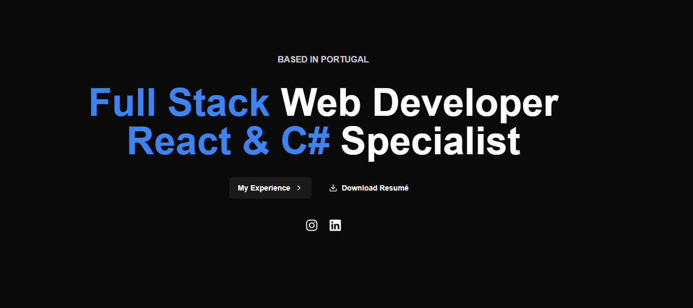

# Paulo Silva - Portfolio

🚀 **Welcome to my portfolio repository!** This project showcases my skills, experience, and projects as a fullstack developer specializing in **React, .NET, and SQL Server**.

## 🌍 Live Website
🔗 [Check it here!](https://pjorgesilvaa.github.io/portfolio/)

## 🛠️ Technologies Used
- **Frontend:** Next.js, React, TypeScript, Tailwind CSS
- **Hosting & Deployment:** GitHub Pages
- **Other:** GitHub Actions (CI/CD)

## 📷 Screenshots


## 🔥 Features
- Interactive UI with smooth animations
- Fully responsive across desktop and mobile
- Project showcase with live demos and GitHub links
- Contact information

## 🏗️ Installation & Running Locally
Clone the repository:
```bash
git clone https://github.com/pjorgesilvaa/portfolio.git
cd portfolio
```

Install dependencies:
```bash
npm install
```

Run the development server:
```bash
npm run dev
```

## 📬 Contact
Feel free to reach out for collaboration or opportunities:

- 📧 Email: pjorge.silvaa@gmail.com
- 🔗 LinkedIn: [https://www.linkedin.com/in/paulo-silva171/](https://www.linkedin.com/in/paulo-silva171/)
- 🐙 GitHub: [https://github.com/pjorgesilvaa](https://github.com/pjorgesilvaa)